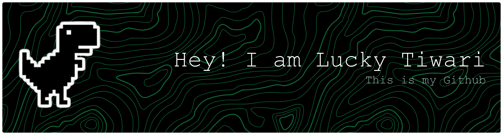

# 💫 About Me:
🔭 I’m currently working on AI-powered applications and Android projects  🤝 I’m looking to collaborate on Generative AI and real-world problem-solving systems  🌱 I’m currently learning system design and AI.  💬 Ask me about AI, Android development, and automation workflows(N8N)  ⚡ Fun fact: I love building practical tech that actually solves problems

## 🌐 Socials:
 

# 💻 Tech Stack:
                      
# 📊 GitHub Stats:
 
 

---

<!-- Proudly created with GPRM ( https://gprm.itsvg.in ) -->
